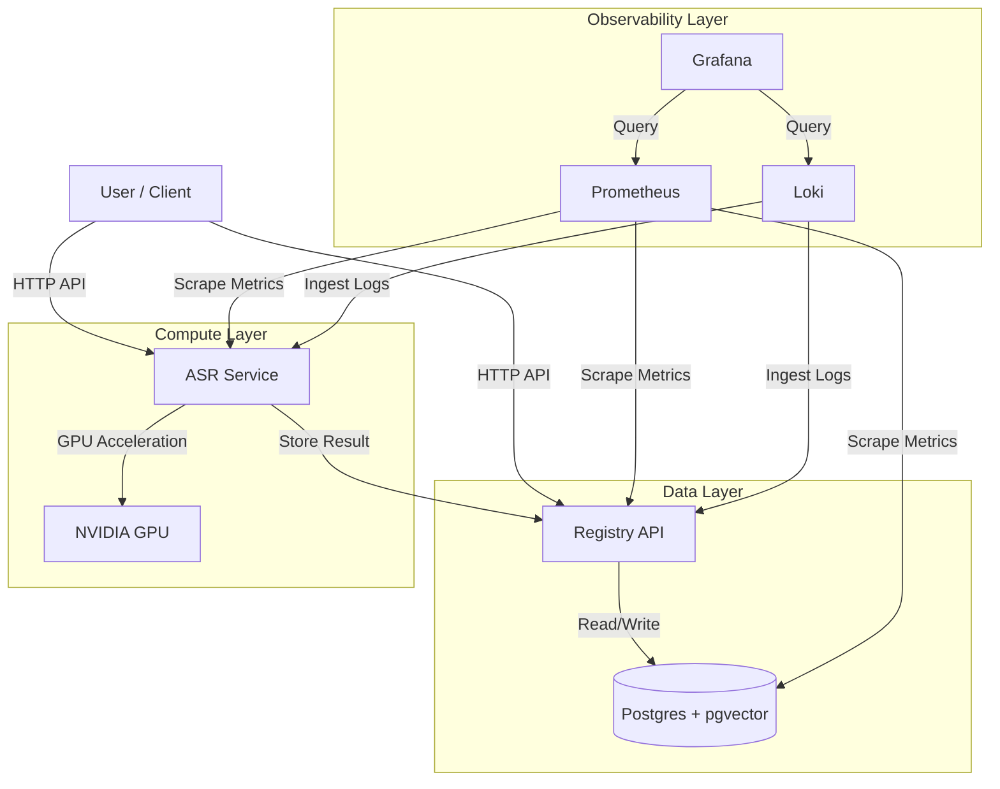

# System Architecture

The DHG AI Factory is designed as a modular, local-first AI processing stack. It leverages containerization for consistency and scalability, with a focus on observability and data integrity.

## High-Level Overview

## Components

### 1. Registry Service (Core)
The central nervous system of the factory.
- **Role**: Manages all metadata, media assets, and transcription results.
- **Tech Stack**: Python (FastAPI), SQLAlchemy, Pydantic.
- **Database**: PostgreSQL 15 with `pgvector` for future semantic search capabilities.
- **Key Features**:
    - UUID-based entity tracking.
    - Audit logging for all operations.
    - Health and metrics endpoints.

### 2. ASR Service (Compute)
Dedicated service for speech-to-text processing.
- **Role**: Transcribes audio files into text with timestamps.
- **Tech Stack**: Python (FastAPI), OpenAI Whisper.
- **Hardware Acceleration**: 
    - **NVIDIA GPU**: Uses CUDA for high-performance inference (production).
    - **CPU Fallback**: Automatically degrades to CPU if no GPU is found (dev/mac).
- **Integration**: Pushes results directly to the Registry API upon completion.

### 3. Observability Stack
Ensures the system is monitored and debuggable.
- **Prometheus**: Time-series database for metrics (latency, error rates, throughput).
- **Loki**: Log aggregation system (like Splunk/ELK but for logs).
- **Grafana**: Visualization dashboard for metrics and logs.

## Data Flow

1. **Ingestion**: User uploads an audio file to the ASR Service.
2. **Processing**: ASR Service processes the audio (using GPU if available).
3. **Storage**: 
    - ASR Service calls Registry API to store the transcript.
    - Registry API saves metadata and text to PostgreSQL.
4. **Monitoring**: 
    - Prometheus scrapes metrics from both services every 15s.
    - Logs are shipped to Loki.
    - User views system health in Grafana.
