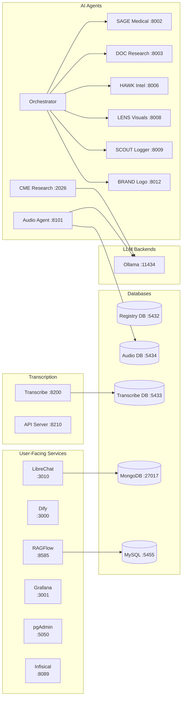
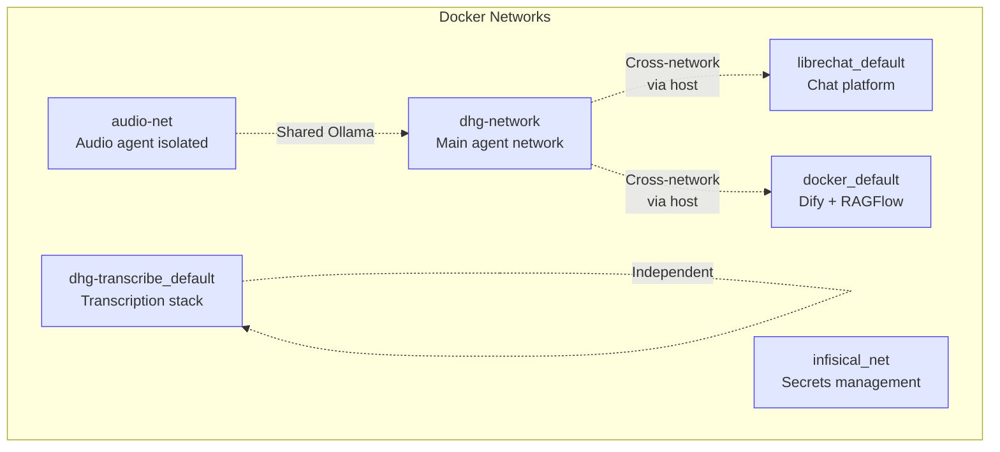

# DHG AI Factory - Docker Infrastructure Diagram

A comprehensive visualization of the Docker infrastructure on server 10.0.0.251.

## Complete Infrastructure Diagram

```mermaid
flowchart TB
    subgraph Internet["🌐 EXTERNAL ACCESS"]
        User["👤 User"]
    end

    subgraph Ports["📡 EXPOSED PORTS"]
        direction LR
        P3000["3000 - Dify/Nginx"]
        P3001["3001 - Grafana"]
        P3010["3010 - LibreChat"]
        P3100["3100 - Loki"]
        P5050["5050 - pgAdmin"]
        P8089["8089 - Infisical"]
        P8585["8585 - RAGFlow"]
        P9090["9090 - Prometheus"]
        P11434["11434 - Ollama"]
    end

    User --> Ports

    subgraph Network_dhg["🔗 dhg-network"]
        subgraph Core_Infra["🏗️ CORE INFRASTRUCTURE"]
            Registry_DB[("dhg-registry-db<br/>pgvector:pg15<br/>:5432")]
            Ollama["dhg-ollama<br/>ollama/ollama<br/>:11434"]
            Redis["dhg-studio-redis<br/>redis<br/>:6379"]
        end

        subgraph Orchestrator_Layer["🎯 ORCHESTRATION"]
            Orchestrator["dhg-aifactory-orchestrator<br/>Master Agent<br/>:8000 (internal)"]
            CME_Research["dhg-cme-research-agent<br/>LangGraph Cloud<br/>:2026"]
        end

        subgraph Active_Agents["🤖 ACTIVE SPECIALIZED AGENTS"]
            Medical["dhg-medical-llm<br/>SAGE Agent<br/>:8002"]
            Research["dhg-research<br/>DOC Agent<br/>:8003"]
            Competitor["dhg-competitor-intel<br/>HAWK Agent<br/>:8006"]
            Visuals["dhg-visuals-media<br/>LENS Agent<br/>:8008"]
            Session["dhg-session-logger<br/>SCOUT Agent<br/>:8009"]
            Registry_API["dhg-registry-api<br/>API Server<br/>:8011"]
            Logo["dhg-logo-maker<br/>BRAND Agent<br/>:8012"]
        end

        subgraph Stopped_Agents["⏸️ STOPPED AGENTS"]
            Curriculum["dhg-curriculum<br/>PROF<br/>:8004"]
            Outcomes["dhg-outcomes<br/>CHART<br/>:8005"]
            QA["dhg-qa-compliance<br/>ACE<br/>:8007"]
        end

        Orchestrator --> Registry_DB
        Orchestrator --> Ollama
        CME_Research --> Ollama
        Medical --> Registry_DB
        Research --> Registry_DB
        Competitor --> Registry_DB
        Visuals --> Registry_DB
        Session --> Registry_DB
        Logo --> Registry_DB
    end

    subgraph Network_audio["🔗 audio-net"]
        subgraph Audio_Stack["🎵 AUDIO AGENT STACK"]
            Audio_Agent["dhg-audio-agent<br/>Audio Analysis<br/>:8101"]
            Audio_Postgres[("dhg-audio-postgres<br/>pgvector:pg16<br/>:5434")]
        end
        Audio_Agent --> Audio_Postgres
        Audio_Agent --> Ollama
    end

    subgraph Network_transcribe["🔗 dhg-transcribe_default"]
        subgraph Transcribe_Stack["📝 TRANSCRIPTION PIPELINE"]
            Transcribe["dhg-transcribe<br/>Main Service<br/>:8200"]
            Preprocessor["dhg-preprocessor<br/>Audio Prep<br/>:8203"]
            NLP_Processor["dhg-nlp-processor<br/>NLP<br/>:8204"]
            NLP_Enrichment["dhg-nlp-enrichment<br/>Enrichment<br/>:8205"]
            QC_Service["dhg-qc-service<br/>Quality Check<br/>:8206"]
            API_Server["dhg-api-server<br/>REST API<br/>:8210"]
            Worker["dhg-worker<br/>Background"]
            Cognitive["dhg-cognitive<br/>Cognitive<br/>:8100"]
        end

        subgraph Transcribe_Infra["Transcription Infrastructure"]
            Trans_DB[("dhg-transcribe-db<br/>postgres:16<br/>:5433")]
            Trans_Redis["dhg-transcribe-redis<br/>redis<br/>:6380"]
            Trans_Qdrant["dhg-transcribe-qdrant<br/>qdrant<br/>:6333-6334"]
            Trans_Minio["dhg-transcribe-minio<br/>minio<br/>:9000-9001"]
        end

        Transcribe --> Trans_DB
        Transcribe --> Trans_Redis
        API_Server --> Trans_DB
        Worker --> Trans_Redis
        NLP_Processor --> Trans_Qdrant
    end

    subgraph Network_librechat["🔗 librechat_default"]
        subgraph LibreChat_Stack["💬 LIBRECHAT"]
            LC_API["LibreChat<br/>Chat UI<br/>:3010"]
            LC_MongoDB[("chat-mongodb<br/>mongo:8.0<br/>:27017")]
            LC_Meili["chat-meilisearch<br/>meilisearch<br/>:7700"]
            LC_VectorDB[("vectordb<br/>pgvector<br/>:5432")]
            LC_RAG["rag_api<br/>RAG Service"]
        end
        LC_API --> LC_MongoDB
        LC_API --> LC_Meili
        LC_API --> LC_RAG
        LC_RAG --> LC_VectorDB
    end

    subgraph Network_dify["🔗 docker_default / docker_ragflow"]
        subgraph Dify_Stack["🔮 DIFY PLATFORM"]
            Dify_Nginx["docker-nginx<br/>nginx<br/>:3000/:3443"]
            Dify_API["docker-api<br/>Dify API<br/>:5001"]
            Dify_Worker["docker-worker<br/>Worker"]
            Dify_Beat["docker-worker_beat<br/>Scheduler"]
            Dify_Web["docker-web<br/>Frontend"]
            Dify_Sandbox["docker-sandbox<br/>Code Exec"]
            Dify_SSRF["docker-ssrf_proxy<br/>Squid"]
            Dify_Plugin["docker-plugin_daemon<br/>Plugins<br/>:5003"]
            Dify_Redis["docker-redis<br/>redis"]
        end

        subgraph RAGFlow_Stack["📊 RAGFLOW"]
            RAGFlow["docker-ragflow-cpu<br/>RAGFlow<br/>:8585/:9380-9382"]
            RAG_ES["docker-es01<br/>Elasticsearch<br/>:1200"]
            RAG_MySQL[("docker-mysql<br/>MySQL 8.0<br/>:5455")]
            RAG_Minio["docker-minio<br/>Minio<br/>:9010-9011"]
        end

        Dify_Nginx --> Dify_API
        Dify_Nginx --> Dify_Web
        Dify_API --> Dify_Redis
        Dify_Worker --> Dify_Redis
        RAGFlow --> RAG_ES
        RAGFlow --> RAG_MySQL
        RAGFlow --> RAG_Minio
    end

    subgraph Network_infisical["🔗 infisical_net / infisical-stack"]
        subgraph Infisical_Stack["🔐 SECRETS MANAGEMENT"]
            Infisical_Main["infisical<br/>Infisical<br/>"]
            Infisical_Backend["infisical-backend<br/>API<br/>:8089"]
            Infisical_DB[("infisical-db<br/>postgres:14<br/>")]
            Infisical_Redis["infisical-redis<br/>redis:7"]
            Infisical_Dev_Redis["infisical-dev-redis<br/>redis"]
            Infisical_Postgres[("infisical-postgres<br/>postgres:16")]
        end
        Infisical_Backend --> Infisical_DB
        Infisical_Backend --> Infisical_Redis
    end

    subgraph Network_monitoring["🔗 Monitoring Stack"]
        subgraph Observability["📈 OBSERVABILITY"]
            Grafana["dhg-grafana<br/>Grafana<br/>:3001"]
            Prometheus["dhg-prometheus<br/>Prometheus<br/>:9090"]
            Loki["dhg-loki<br/>Loki<br/>:3100"]
            PGAdmin["pgadmin<br/>pgAdmin4<br/>:5050"]
        end
        Grafana --> Prometheus
        Grafana --> Loki
        PGAdmin --> Registry_DB
    end

    %% Cross-network connections
    Orchestrator -.-> LC_API
    CME_Research -.-> LC_API
    Audio_Agent -.-> Ollama
    
    classDef running fill:#10B981,stroke:#059669,color:#fff
    classDef stopped fill:#EF4444,stroke:#DC2626,color:#fff
    classDef database fill:#3B82F6,stroke:#2563EB,color:#fff
    classDef infra fill:#8B5CF6,stroke:#7C3AED,color:#fff
    classDef external fill:#F59E0B,stroke:#D97706,color:#fff

    class Orchestrator,CME_Research,Medical,Research,Competitor,Visuals,Session,Logo,Registry_API,Audio_Agent running
    class Curriculum,Outcomes,QA stopped
    class Registry_DB,Audio_Postgres,Trans_DB,LC_MongoDB,LC_VectorDB,RAG_MySQL,Infisical_DB,Infisical_Postgres database
    class Ollama,Redis,Trans_Redis,Trans_Qdrant,Trans_Minio,Dify_Redis,RAG_ES,RAG_Minio,Infisical_Redis infra
    class User external
```

---

## Simplified Service Map

---

## Port Summary Table

| Port | Service | Purpose |
|------|---------|---------|
| **3000** | Dify/Nginx | Dify AI Platform |
| **3001** | Grafana | Monitoring Dashboard |
| **3010** | LibreChat | Chat Interface |
| **3100** | Loki | Log Aggregation |
| **5050** | pgAdmin | Database Admin |
| **5432** | dhg-registry-db | Main Registry Database |
| **5433** | dhg-transcribe-db | Transcription Database |
| **5434** | dhg-audio-postgres | Audio Agent Database |
| **5455** | docker-mysql | RAGFlow MySQL |
| **6333-6334** | Qdrant | Vector DB (Transcribe) |
| **6379** | Redis | Studio Cache |
| **6380** | Redis | Transcribe Cache |
| **7700** | Meilisearch | LibreChat Search |
| **8002** | dhg-medical-llm | SAGE Medical Agent |
| **8003** | dhg-research | DOC Research Agent |
| **8006** | dhg-competitor-intel | HAWK Intel Agent |
| **8008** | dhg-visuals-media | LENS Visuals Agent |
| **8009** | dhg-session-logger | SCOUT Logger Agent |
| **8011** | dhg-registry-api | Registry API |
| **8012** | dhg-logo-maker | BRAND Logo Agent |
| **8089** | infisical-backend | Secrets Management |
| **8100** | dhg-cognitive | Cognitive Service |
| **8101** | dhg-audio-agent | Audio Analysis Agent |
| **8200** | dhg-transcribe | Transcription Main |
| **8203** | dhg-preprocessor | Audio Preprocessing |
| **8204** | dhg-nlp-processor | NLP Processing |
| **8205** | dhg-nlp-enrichment | NLP Enrichment |
| **8206** | dhg-qc-service | Quality Control |
| **8210** | dhg-api-server | Transcribe API |
| **8585** | RAGFlow | RAG Platform |
| **9000-9001** | Minio | Object Storage (Transcribe) |
| **9010-9011** | Minio | Object Storage (RAGFlow) |
| **9090** | Prometheus | Metrics Collection |
| **11434** | Ollama | Local LLM Server |
| **2026** | dhg-cme-research-agent | LangGraph CME Agent |

---

## Container Status Summary

| Status | Count | Examples |
|--------|-------|----------|
| **Running** | 40+ | LibreChat, Dify, RAGFlow, All active agents |
| **Healthy** | 20+ | All databases, Redis instances |
| **Stopped** | 3 | dhg-curriculum, dhg-outcomes, dhg-qa-compliance |

---

## Network Architecture

---

*Generated: 2026-02-07 16:41*
