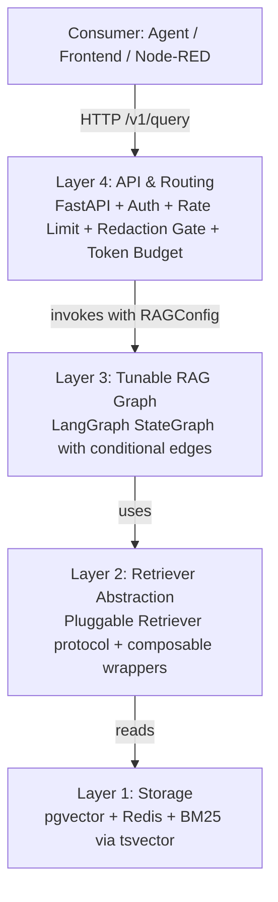
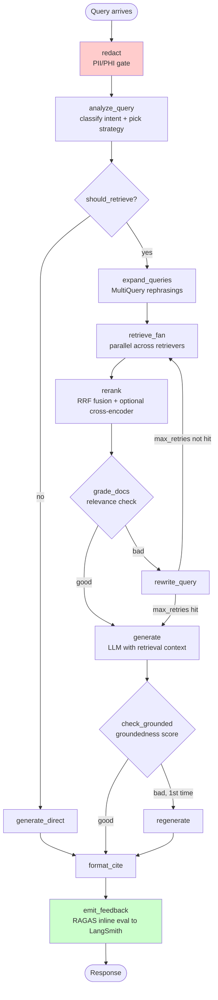
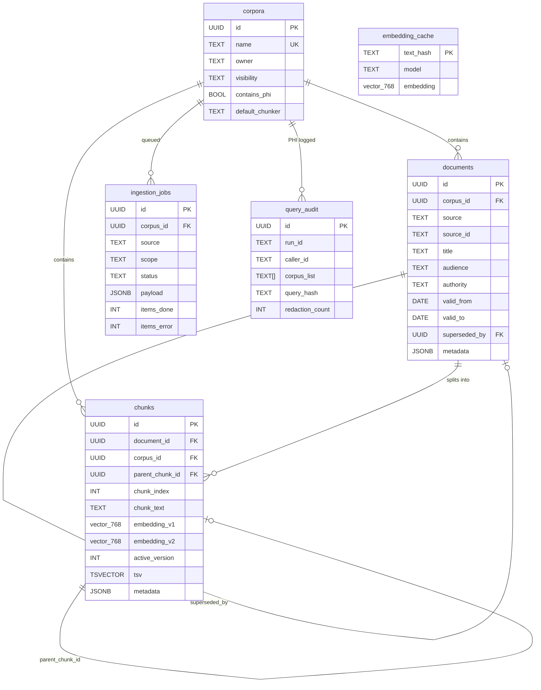
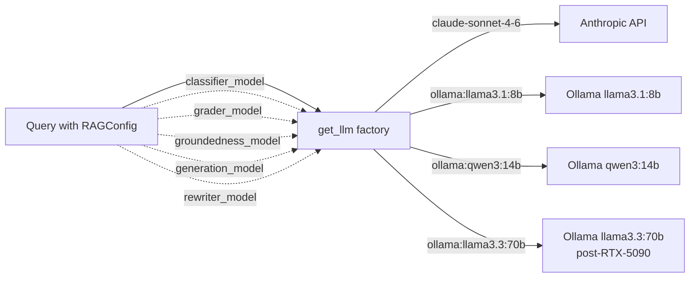
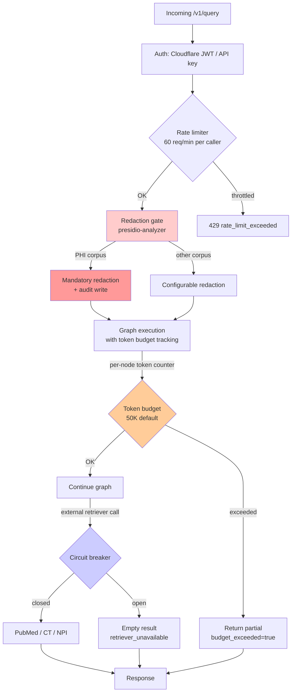
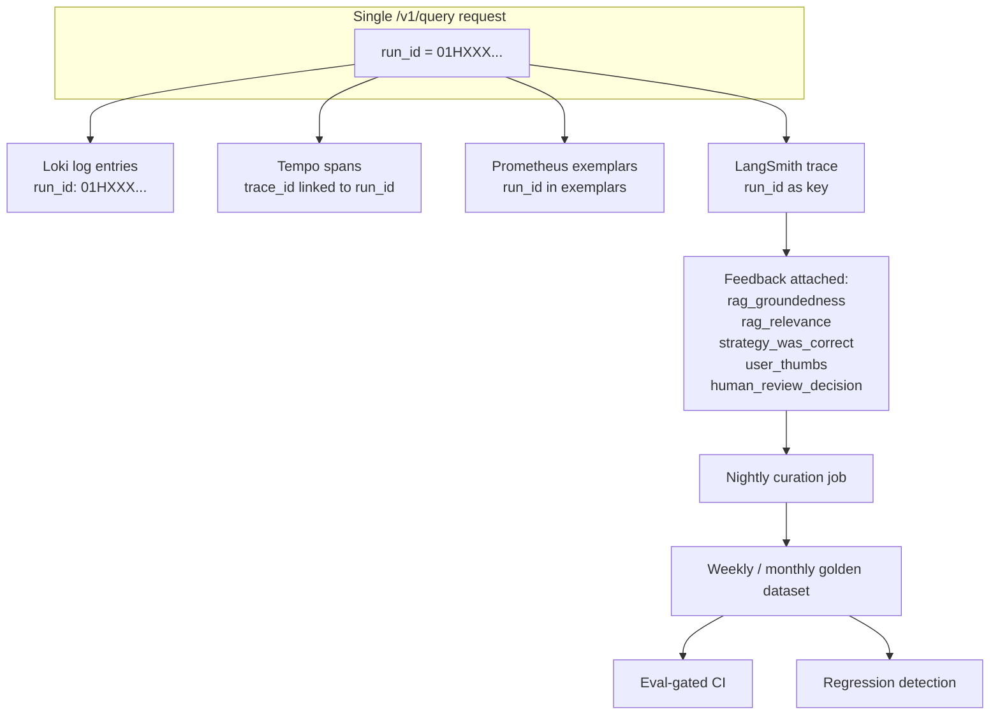
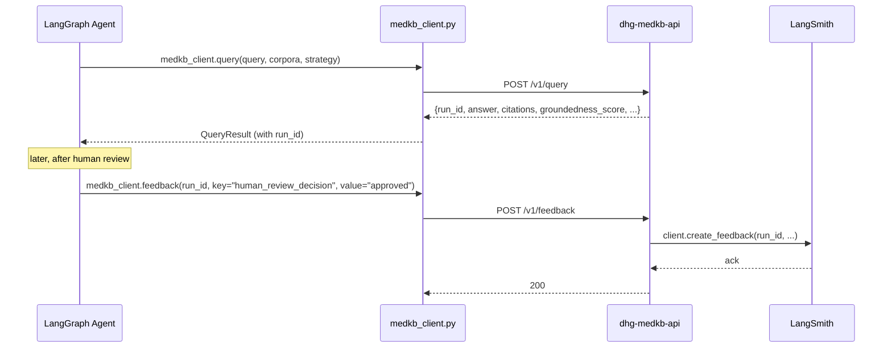
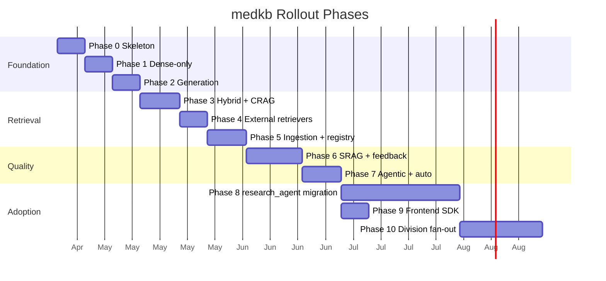
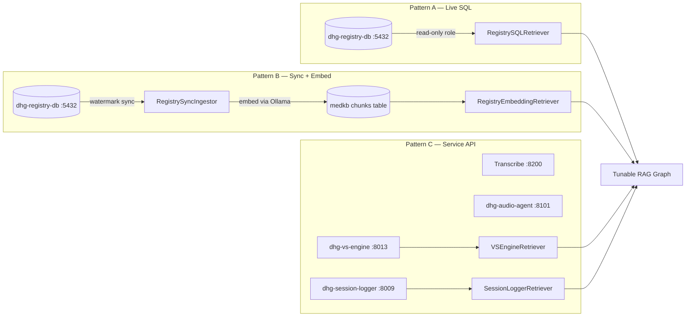

# medkb Architecture

> **Scope:** High-level visual overview of the medkb central RAG-as-a-Service platform.
> **Full design spec:** `docs/superpowers/specs/2026-04-17-medkb-rag-as-a-service-design.md`
> **Canonical architecture for the wider system:** `docs/Architecture.md` (project root) and `CLAUDE.md`.

---

## Purpose

**medkb is the single retrieval plane for all DHG knowledge work.** Any agent, workflow, or frontend that needs grounded information calls medkb over HTTP. It runs a tunable LangGraph that scales from fast retrieve-and-generate to full agentic self-reflective RAG per query.

- **Tunable:** per-query strategy selection (regular | CRAG | SRAG | agentic | auto)
- **Multi-tenant:** corpora are the tenancy primitive; every division has its own
- **LLM-agnostic:** model is a per-query parameter — Claude today, `llama3.3:70b` after RTX 5090
- **HIPAA-aware:** PII/PHI redaction is a mandatory graph node for tagged corpora
- **Observable:** every query is a correlated trace across Tempo + Prometheus + Loki + LangSmith

---

## System context

```mermaid
graph LR
    subgraph "DHG Consumers"
        Agents[17+ LangGraph Agents]
        Frontend[Next.js Frontend :3000]
        NodeRED[Node-RED Flows]
        Future[Future Divisions]
    end

    subgraph "medkb"
        API[dhg-medkb-api :8015]
        Worker[dhg-medkb-ingestor]
        DB[(dhg-medkb-db<br/>PostgreSQL + pgvector :5433)]
        Cache[(dhg-medkb-cache<br/>Redis :6380)]
    end

    subgraph "DHG Platform Services"
        RegistryDB[(dhg-registry-db<br/>PostgreSQL :5432<br/>64 tables)]
        RegistryAPI[dhg-registry-api :8011]
        VSEngine[dhg-vs-engine :8013]
        SessionLog[dhg-session-logger :8009]
        Transcribe[Transcribe Pipeline :8200]
        AudioAgent[dhg-audio-agent :8101]
    end

    subgraph "External Dependencies"
        Ollama[dhg-ollama :11434]
        Anthropic[Anthropic API]
        PubMed[PubMed MCP]
        CT[ClinicalTrials MCP]
        NPI[NPI Registry MCP]
    end

    subgraph "Observability"
        Tempo[Tempo :3200]
        Prometheus[Prometheus :9090]
        Loki[Loki :3100]
        LangSmith[LangSmith Cloud]
    end

    Agents -->|HTTP| API
    Frontend -->|TypeScript SDK| API
    NodeRED -->|HTTP| API
    Future -->|HTTP| API

    API --> DB
    API --> Cache
    API -->|embeddings + local LLMs| Ollama
    API -->|generation LLM| Anthropic
    API -->|external retrievers| PubMed
    API -->|external retrievers| CT
    API -->|external retrievers| NPI

    API -->|Pattern A: read-only SQL| RegistryDB
    API -->|Pattern C: HTTP| VSEngine
    API -->|Pattern C: HTTP| SessionLog
    API -->|Pattern C: HTTP| Transcribe
    API -->|Pattern C: HTTP| AudioAgent

    Worker --> DB
    Worker --> Ollama
    Worker -->|Pattern B: sync + embed| RegistryDB

    API -->|@traced_node| Tempo
    API -->|metrics| Prometheus
    API -->|logs via Promtail| Loki
    API -->|@traceable + feedback| LangSmith
```

All DHG services on `dhgaifactory35_dhg-network` (registry, agents, Ollama, VS Engine, Session Logger, observability) are reachable directly by hostname. medkb treats the registry database and platform services as first-class data sources — see "DHG Source Inventory" below.

---

## Layered architecture



Each layer has a single concern and a well-defined interface to the one below. Layer 2's Retriever protocol is the key extension point — adding Qdrant, Elasticsearch, or a new MCP tool is a new implementation, not a rewrite.

---

## The tunable RAG graph (Layer 3)



**Strategy → active nodes:**

| Strategy | Active nodes | Use case |
|----------|-------------|----------|
| `regular` | redact → analyze → retrieve → rerank → generate → format → emit | Low-stakes fast lookups |
| `crag` | + expand + grade + rewrite loop | Medical relevance matters |
| `srag` | + check_grounded + regenerate | CME drafting, compliance |
| `agentic` | Full graph + LLM tool fan-out, multi-hop | Multi-step research |
| `auto` | `analyze_query` picks one of the above via rule-based classifier | Default |

The graph is **one compiled StateGraph** — conditional edges read `RAGConfig` from state to skip optional nodes. This means every strategy produces one LangSmith trace; a single execution can escalate through conditional paths based on intermediate results.

---

## Retriever abstraction (Layer 2)

```mermaid
classDiagram
    class Retriever {
        <<Protocol>>
        +name: str
        +retrieve(query, k, filters, corpus_ids) list~RetrievedChunk~
    }

    class PgVectorRetriever {
        Dense similarity via HNSW
        Reads active_version column
    }

    class BM25Retriever {
        Sparse full-text via pg tsvector
        ts_rank_cd scoring
    }

    class HybridRetriever {
        Runs dense + sparse in parallel
        Fuses via Reciprocal Rank Fusion
    }

    class PubMedRetriever {
        Wraps PubMed MCP tool
    }

    class ClinicalTrialsRetriever {
        Wraps ClinicalTrials.gov MCP
    }

    class NPIRetriever {
        Wraps NPI registry MCP
    }

    class MultiQueryWrapper {
        Decorator — 3-5 query rephrasings
        Wraps any Retriever
    }

    class ParentDocumentWrapper {
        Retrieves small chunks
        Returns parent document context
    }

    class EnsembleRetriever {
        Weighted combination of N retrievers via RRF
    }

    class CrossEncoderReranker {
        Phase 5 — optional post-retrieval rerank
        BAAI/bge-reranker-base
    }

    class RegistrySQLRetriever {
        Pattern A — Live SQL
        Read-only connection to registry DB
    }

    class RegistryEmbeddingRetriever {
        Pattern B — Synced embeddings
        Watermark-based periodic sync
    }

    class VSEngineRetriever {
        Pattern C — Service API
        HTTP to dhg-vs-engine :8013
    }

    class SessionLoggerRetriever {
        Pattern C — Service API
        HTTP to dhg-session-logger :8009
    }

    Retriever <|.. PgVectorRetriever
    Retriever <|.. BM25Retriever
    Retriever <|.. HybridRetriever
    Retriever <|.. PubMedRetriever
    Retriever <|.. ClinicalTrialsRetriever
    Retriever <|.. NPIRetriever
    Retriever <|.. MultiQueryWrapper
    Retriever <|.. ParentDocumentWrapper
    Retriever <|.. EnsembleRetriever
    Retriever <|.. CrossEncoderReranker
    Retriever <|.. RegistrySQLRetriever
    Retriever <|.. RegistryEmbeddingRetriever
    Retriever <|.. VSEngineRetriever
    Retriever <|.. SessionLoggerRetriever

    HybridRetriever o-- PgVectorRetriever
    HybridRetriever o-- BM25Retriever
    MultiQueryWrapper o-- Retriever : wraps
    EnsembleRetriever o-- Retriever : combines N
```



**Composition example:**

```python
retriever = MultiQueryWrapper(
    HybridRetriever(
        dense=PgVectorRetriever(),
        sparse=BM25Retriever(),
        weight_dense=0.7,
    ),
    num_queries=4,
)
```

A **retriever registry** maps corpus → default composition. Callers override per-query via `retriever_spec` if needed.

---

## Data model (Layer 1)



**Key schema invariants:**

- `chunks.active_version` — dual-embedding schema enables zero-downtime model migrations. `embedding_v1` and `embedding_v2` live side-by-side; atomic flip switches retrieval to the new model.
- `documents.valid_to IS NULL` — currently authoritative; retrieval filters non-null by default
- `query_hash` is sha256 of query text, NOT raw text — PHI audit logs never store raw queries
- Every chunk has exactly one corpus; RBAC filtering happens before retrieval

---

## Model routing



**Model-per-node configuration.** Every LLM-calling graph node routes through a single factory; 5 independent model slots in `RAGConfig`. Claude stays on generation for CME; auxiliary calls (classify, grade, reflect, rewrite) run on local models. After RTX 5090 arrives, generation can migrate to `ollama:llama3.3:70b` via config flag alone — no code change.

---

## Resilience & Safety



**Four concentric defenses** against HIPAA, cost runaway, upstream failures, and adversarial content:

| Defense | Mechanism | Default |
|---------|-----------|---------|
| Rate limiting | Token bucket per caller, Redis-backed | 60 req/min |
| PII/PHI redaction | `presidio-analyzer` as first graph node | Mandatory for `contains_phi=true` corpora |
| Token budget | Per-node counter, hard-stop on exceed | 50K tokens per query |
| Circuit breakers | `pybreaker` per external retriever | 5 failures in 30s → open for 60s |
| Prompt injection | XML-wrapped retrieval + system prompt + ingest-time detection | Always on |
| Graceful degradation | Client-side fallback on medkb 5xx → `retrieval_unavailable=true` | Always on |

---

## Observability correlation



Every `/v1/query` produces **one run_id** that threads through all four observability tools. Grafana Explore enables single-ID pivoting: start with a Prometheus alert, follow to Tempo trace, pull matching Loki logs, jump to LangSmith for LLM detail.

---

## Consumer integration



Consumer always uses `medkb_client.py` wrapper, never raw HTTP. Client handles:
- Auth header injection (Cloudflare JWT or API key)
- Retry with exponential backoff
- Graceful degradation (returns `retrieval_unavailable=true` on medkb 5xx, never throws)
- Run_id propagation for later feedback

---

## Phased delivery



**Sequencing rule:** every phase must produce visible value and pass a regression check before the next starts.

---

## DHG source inventory

medkb is the single retrieval plane for **all** DHG knowledge — not just externally ingested documents. The registry database and running DHG services are first-class data sources, accessible through three integration patterns.



| Source | Pattern | What it provides | Why this pattern |
|--------|---------|------------------|-----------------|
| **dhg-registry-db** (64 tables) | A + B | Project metadata, document content, session history, agent configs | A for structured lookups (freshness); B for semantic search (embeddings) |
| **dhg-vs-engine** (:8013) | C | Verbalized Sampling alternatives and scores | Service has its own query logic; wrap, don't duplicate |
| **dhg-session-logger** (:8009) | C | Session transcripts with Ollama embeddings | Same — service already indexes its own data |
| **Transcribe pipeline** (:8200) | C | Audio transcription results | High-volume output; query on demand, don't bulk-sync |
| **dhg-audio-agent** (:8101) | C | Audio processing results | Low-volume; API wrapper sufficient |
| **PubMed** (MCP) | External retriever | Medical literature | MCP tool wrapper, same as other external retrievers |
| **ClinicalTrials.gov** (MCP) | External retriever | Clinical trial data | MCP tool wrapper |
| **NPI Registry** (MCP) | External retriever | Provider verification | MCP tool wrapper |

**Security:** Pattern A uses a dedicated `medkb_reader` Postgres role with SELECT-only grants. Pattern B inherits medkb's service identity. Pattern C calls stay within `dhgaifactory35_dhg-network`.

---

## Design decisions (at a glance)

| # | Decision | Reasoning |
|---|----------|-----------|
| 1 | Standalone Docker service (HTTP only) | Agents, frontend, Node-RED, future divisions all consume uniformly |
| 2 | Single configurable LangGraph | Matches existing agent pattern; one trace per query; conditional-edge escalation |
| 3 | Retriever as Python `Protocol` | Swap pgvector → Qdrant later without rewriting agents |
| 4 | Hybrid dense + BM25 default | Medical queries need both semantic and exact-term matching |
| 5 | Model-per-node config | Claude only where it matters; ~90% cost reduction |
| 6 | Dual-embedding schema | Zero-downtime embedding model migrations |
| 7 | Separate Postgres on :5433 | Bulk ingestion / HNSW rebuilds must not contend with registry OLTP |
| 8 | Corpora as tenancy primitive | Adding a division = create corpus + RBAC rule, no new service |
| 9 | PHI redaction is mandatory graph node | HIPAA requires defense in depth |
| 10 | Token budget enforcement | No runaway LLM spend in agentic mode |
| 11 | Weekly → monthly dataset snapshots | Immutable baselines enable regression attribution |
| 12 | Rule-based strategy classifier v1 | LLM classifier adds latency + failure mode; defer to Phase 7+ |
| 13 | Registry uses both Pattern A (SQL) and B (embeddings) | Freshness from live SQL + semantic search from synced embeddings — not either/or |
| 14 | DHG services accessed via Pattern C (HTTP wrappers) | Each service owns its data; medkb wraps, never duplicates |

---

## Where to go next

| Need | Read |
|------|------|
| Full design spec with every decision and tradeoff | `docs/superpowers/specs/2026-04-17-medkb-rag-as-a-service-design.md` |
| DHG platform architecture (broader context) | `docs/Architecture.md`, `CLAUDE.md` |
| Operational runbooks | `docs/OBSERVABILITY_RUNBOOK.md` + per-alert runbooks in `docs/runbooks/` (Phase 0) |
| API reference | Auto-generated OpenAPI at `http://dhg-medkb-api:8015/v1/docs` (post-Phase-0) |
| Existing LangGraph conventions | `langgraph_workflows/dhg-agents-cloud/src/tracing.py` (decorators to inherit) |
| Access control / RBAC | `docs/AUTH_AND_RBAC.md` + `registry/auth.py` |

---

*This document is a visual overview. For implementation details, defer to the spec and to code. As medkb is built, keep this document in sync with production topology.*
