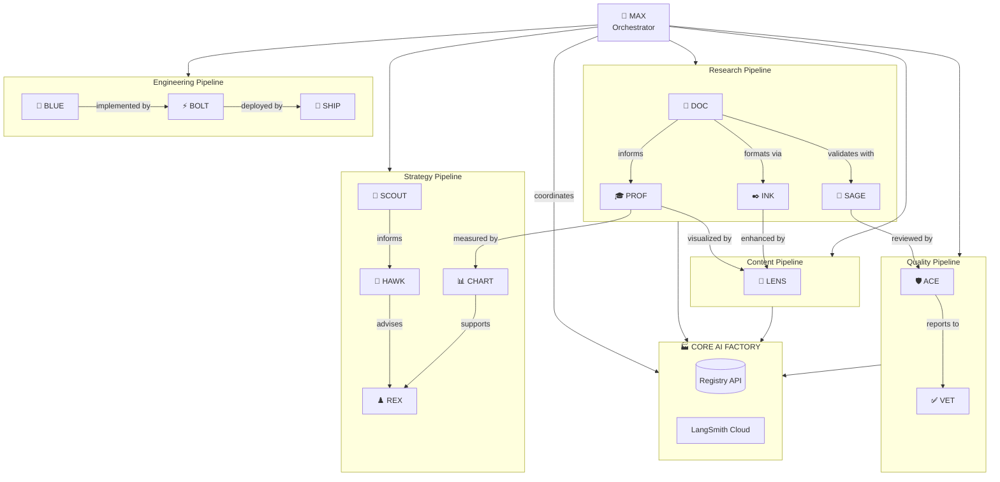

# DHG AI Agent Workforce

> **Digital Harmony Group** — Pioneering the Future of Intelligent Automation

---

## Agent Architecture Overview

The DHG AI Factory operates with a multi-agent architecture where specialized AI agents collaborate to deliver CME content, medical research, and educational materials. **MAX** serves as the Master Orchestrator, coordinating all agent interactions through the Core AI Factory.

---

## 🤖 Technical Agent Registry

| Name | Agent ID | Role | Status | Features | Multi-Agent Connections | Tech Stack |
|------|----------|------|--------|----------|------------------------|------------|
| **MAX** | `orchestrator` | Master Orchestrator | 🟡 Planned | Request routing, agent coordination, load balancing, failover | All agents | LangGraph, Ollama |
| **DOC** | `research` | CME Research Agent | 🟢 Active | PubMed search, clinical evidence synthesis, gap analysis, literature review | SAGE, INK, PROF | LangSmith Cloud, GPT-4o |
| **SAGE** | `medical-llm` | Medical Language Model | 🟢 Active | Medical terminology, clinical validation, drug interactions, ICD-10 coding | DOC, ACE, VET | OpenAI GPT-4o, Medical ontologies |
| **ACE** | `qa-compliance` | QA & Compliance | 🟢 Active | ACCME compliance, disclosure review, bias detection, regulatory checks | All content agents | Custom validators |
| **BLUE** | `architect` | System Architect | 🟡 Planned | Infrastructure design, API schemas, database modeling | BOLT, SHIP | Architecture tools |
| **SCOUT** | `discovery` | Discovery Agent | 🟡 Planned | Trend detection, emerging topics, opportunity identification | HAWK, DOC | Web scraping, APIs |
| **BOLT** | `implementation` | Implementation Agent | 🟡 Planned | Code generation, feature implementation, bug fixes | BLUE, SHIP | Code LLMs |
| **INK** | `scribe` | Documentation Scribe | 🟡 Planned | Content writing, summaries, transcription formatting | DOC, LENS | GPT-4o |
| **HAWK** | `competitor-intel` | Competitor Intelligence | 🟢 Active | Market analysis, competitive landscape, pricing intelligence | SCOUT, REX | Web research |
| **PROF** | `curriculum` | Curriculum Designer | 🟢 Active | Learning objectives, module structuring, assessment design | DOC, CHART | Educational frameworks |
| **CHART** | `outcomes` | Outcomes Analyst | 🟢 Active | Effectiveness metrics, learning outcomes, gap closure tracking | PROF, ACE | Analytics |
| **LENS** | `visuals` | Visual Content Creator | 🟢 Active | Image generation, diagrams, slide decks, infographics | INK, PROF | DALL-E 3, GPT-4o Vision |
| **REX** | `strategy` | Strategy Advisor | 🟡 Planned | Business strategy, market positioning, growth planning | HAWK, CHART | Strategic frameworks |
| **SHIP** | `deployment` | Deployment Manager | 🟡 Planned | CI/CD, container orchestration, release management | BOLT, BLUE | Docker, K8s |
| **VET** | `qa-manager` | QA Manager | 🟡 Planned | Test planning, quality gates, verification workflows | ACE, All agents | Testing frameworks |

**Legend:** 🟢 Active (deployed) | 🟡 Planned (in development)

---

## 👥 DHG AI Team — Staff Directory

*Meet the team powering Digital Harmony Group's AI operations*

| Photo | Name | Title | Department | Reports To | Key Responsibilities | Expertise |
|-------|------|-------|------------|------------|---------------------|-----------|
| 👑 | **MAX** | Chief AI Orchestrator | Executive | CEO | Coordinates all AI operations, routes requests to specialists, ensures quality delivery | Multi-agent coordination, workflow optimization |
| 🔬 | **DOC** | Senior Research Scientist | R&D | MAX | Conducts medical literature reviews, synthesizes clinical evidence, identifies practice gaps | PubMed, clinical research, evidence synthesis |
| 💚 | **SAGE** | Medical Director | Clinical | MAX | Validates medical accuracy, ensures clinical relevance, reviews drug information | Internal medicine, pharmacology, medical terminology |
| 🛡️ | **ACE** | Compliance Officer | Legal & Regulatory | MAX | Ensures ACCME compliance, reviews disclosures, validates regulatory adherence | Healthcare regulations, CME accreditation |
| 📐 | **BLUE** | Enterprise Architect | Engineering | MAX | Designs system architecture, defines API standards, models data structures | System design, cloud architecture |
| 🔭 | **SCOUT** | Trend Analyst | Strategy | REX | Identifies emerging medical education topics, tracks market trends | Market research, trend analysis |
| ⚡ | **BOLT** | Lead Developer | Engineering | BLUE | Implements features, writes production code, fixes bugs | Full-stack development, AI/ML |
| ✒️ | **INK** | Content Editor | Content | DOC | Writes documentation, creates summaries, polishes content | Technical writing, medical communication |
| 🦅 | **HAWK** | Competitive Intelligence Lead | Strategy | REX | Monitors competitors, analyzes market positioning, tracks industry changes | Business intelligence, market analysis |
| 🎓 | **PROF** | Curriculum Director | Education | MAX | Designs learning modules, creates assessments, structures educational content | Instructional design, adult learning |
| 📊 | **CHART** | Analytics Manager | Operations | PROF | Tracks learning outcomes, measures effectiveness, reports on KPIs | Data analytics, educational measurement |
| 📸 | **LENS** | Creative Director | Design | MAX | Creates visual content, designs presentations, produces infographics | Graphic design, visual communication |
| ♟️ | **REX** | VP of Strategy | Executive | CEO | Develops business strategy, guides market positioning, plans growth initiatives | Strategic planning, business development |
| 🚀 | **SHIP** | DevOps Manager | Engineering | BLUE | Manages deployments, maintains CI/CD, ensures system reliability | DevOps, cloud infrastructure, SRE |
| ✅ | **VET** | QA Director | Quality | ACE | Oversees testing, establishes quality gates, validates deliverables | Quality assurance, test automation |

---

## Workflow Connections

---

## Agent Communication Protocol

| From | To | Message Type | Purpose |
|------|----|--------------|---------|
| MAX | All | `task_dispatch` | Assign work to specialists |
| DOC | SAGE | `validation_request` | Request medical accuracy check |
| DOC | INK | `content_draft` | Send content for formatting |
| SAGE | ACE | `clinical_review` | Submit for compliance review |
| PROF | CHART | `assessment_data` | Learning outcomes measurement |
| SCOUT | HAWK | `trend_alert` | New market intelligence |
| BLUE | BOLT | `implementation_spec` | Technical requirements |
| BOLT | SHIP | `deployment_ready` | Ready for release |
| All | MAX | `task_complete` | Report completion status |

---

## Deployment Status

| Agent | Environment | Endpoint | Health |
|-------|-------------|----------|--------|
| DOC (Research) | LangSmith Cloud | `https://cme-research.langsmith.app` | ✅ Healthy |
| SAGE (Medical) | LangSmith Cloud | Assistant in Research | ✅ Healthy |
| Registry API | Docker (.251) | `http://10.0.0.251:8011` | ✅ Healthy |
| LENS (Visuals) | Docker (.251) | Internal | ✅ Healthy |
| MAX (Orchestrator) | Planned | TBD | 🟡 Development |

---

*Last Updated: January 27, 2026*
