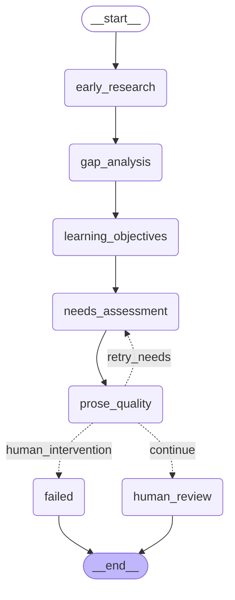
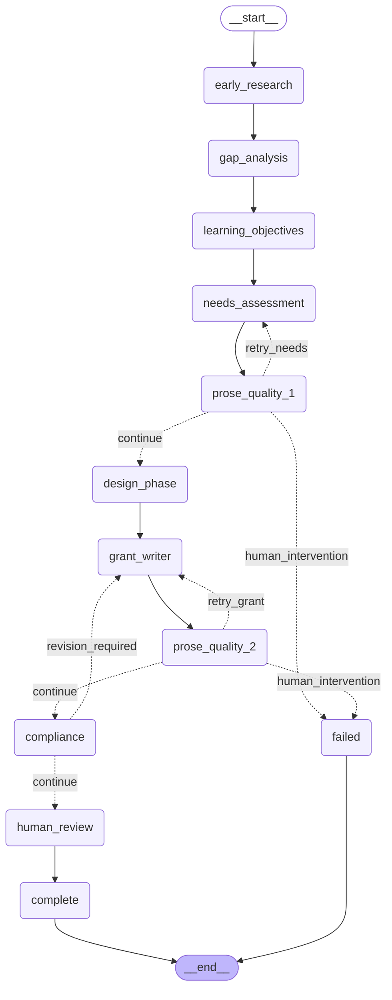

# Recipe-Based Orchestrator - Graph Diagrams

These Mermaid diagrams visualize the CME Grant Pipeline workflows.

## Needs Package Graph

This recipe handles: Research → Gap Analysis → Learning Objectives → Needs Assessment → Prose QA → Human Review



**Key Features:**
- `early_research` runs Research + Clinical agents **in parallel**
- Quality gate after Needs Assessment with retry logic
- Max 3 retries before human intervention

---

## Grant Package Graph (Full Pipeline)

This is the complete 11-agent pipeline with all quality gates.



**Key Features:**
- `early_research` runs Research + Clinical agents **in parallel**
- `design_phase` runs Curriculum + Protocol + Marketing **in parallel**
- Two prose quality gates with retry logic
- Compliance gate with revision loop
- Human review as final gate

---

## Pipeline Flow Summary

```
INTAKE
    ↓
early_research (Research + Clinical PARALLEL)
    ↓
gap_analysis
    ↓
learning_objectives
    ↓
needs_assessment ←──────┐
    ↓                   │ retry
prose_quality_1 ────────┘
    ↓ pass
design_phase (Curriculum + Protocol + Marketing PARALLEL)
    ↓
grant_writer ←──────────┐
    ↓                   │ retry
prose_quality_2 ────────┘
    ↓ pass
compliance
    ↓ pass
human_review
    ↓ approved
complete
```

---

## Decision #10: Recipe-Based Orchestrator

**Confirmed:** 2026-02-04

**Key Implementation Details:**
- 4 composable recipes: needs_graph, curriculum_graph, grant_graph, full_graph
- Parallel execution using asyncio.gather for fan-out/fan-in
- PostgresSaver checkpointing (optional, with fallback)
- LangSmith tracing on all agent wrapper nodes
- Comprehensive error handling with retry matrix
- Human review routing for approval/revision/reject flows
